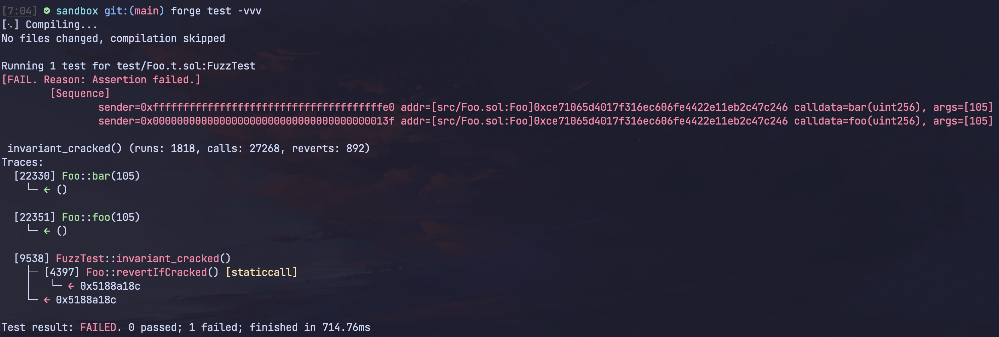
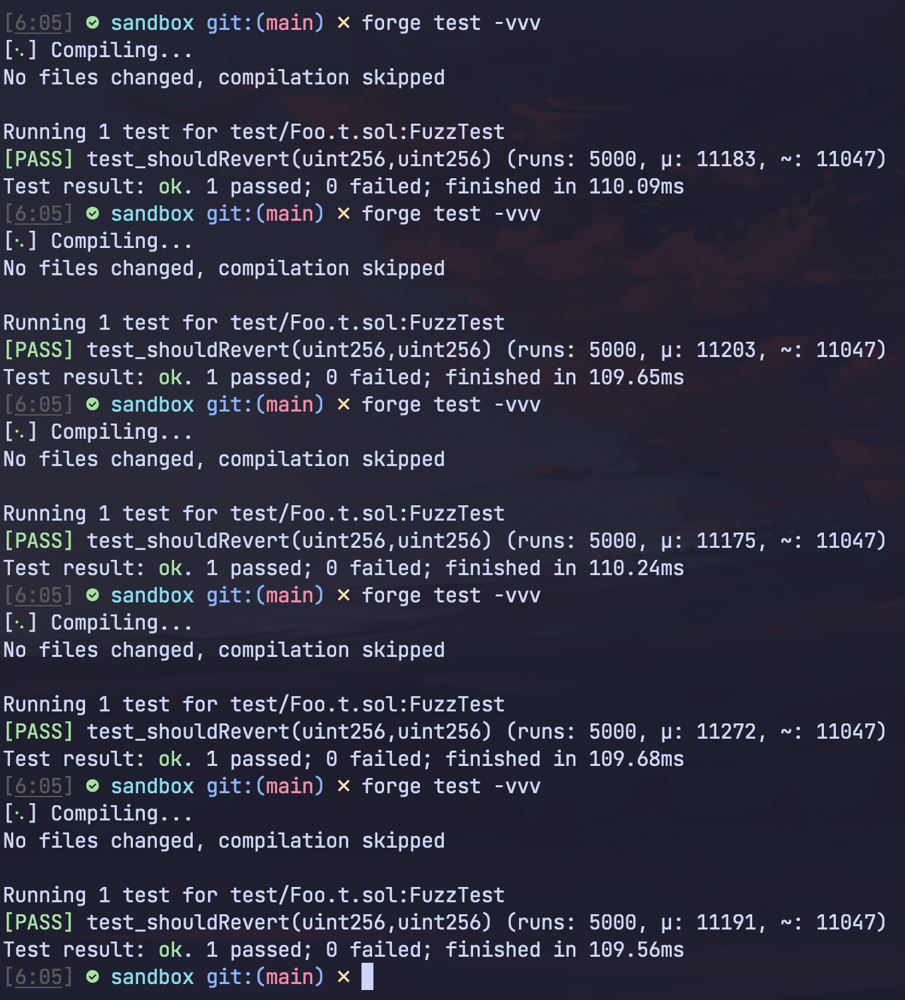
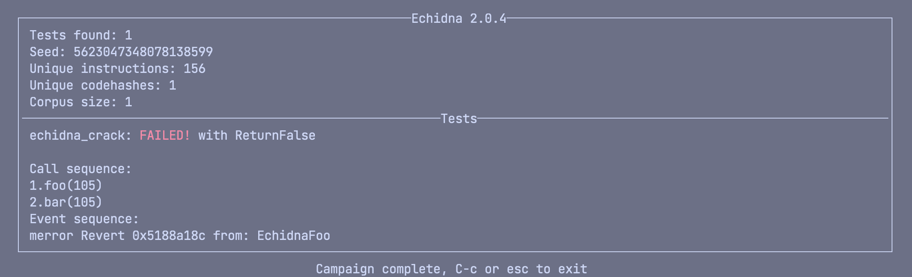
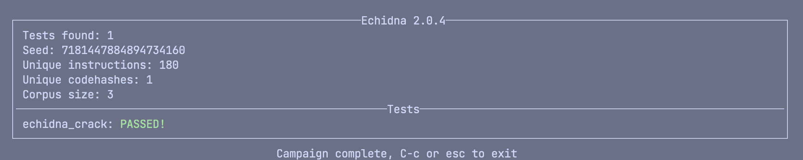

# Forge vs. Echidna testing

> **Note**
> Failing CI is intended here.

Sample contract to test Forge vs. Echidna's fuzzing mechanisms for @transmissions11.

The objective is to find two inputs equal to the magic number `0x69` to supply to `Foo`'s `foo(uint256)` and `bar(uint256)` functions. If both `foo` and `bar` are called with an input of `0x69`, `revertIfCracked` will fail the test.

Both fuzzers are able to find the revert case consistently for `Foo`:
* Forge finds the revert case consistently with an `invariant_*` test.
  * Forge fails to do so roughly ~80-90% of the time in fuzz mode. (Note, for the case in this repo, an invariant style test is better suited anyways)
* Echidna finds the revert case consistently.

However, an interesting observation is that when using `bytes32` rather than `uint256` as inputs for `foo` and `bar` (see: `FooBytes.sol`), forge is significantly more reliable at finding the revert case than Echidna.

### Versions

Forge: `18791dfa2f8c5ea7df99cc7bc6e00e1d20c02499` 

Echidna: `2.0.4`

### `Foo` cases:

#### Forge

Invariants:

Fuzzing:

#### Echidna
Cmd: `echidna-test ./test/EchidnaFoo.sol --contract EchidnaFoo --test-mode property`

### `FooBytes` cases:

#### Forge

#### Echidna

Echidna fails to detect the revert case for the `FooBytes` version of this test case:

